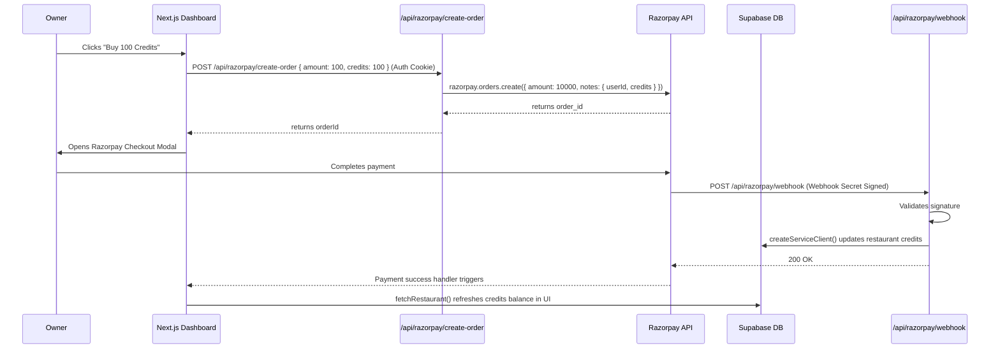

# Design Spec: Slice 7 - "Credits Work"

Self-serve billing integration allowing restaurant owners to purchase additional WhatsApp message credits using Razorpay.

## Requirements

1. **Credits Balance display**: The owner can view their remaining credits on the dashboard and settings pages.
2. **Top-up packages**: Self-serve options to buy:
   * 100 credits for ₹100
   * 500 credits for ₹500
   * 1000 credits for ₹1000
3. **Razorpay integration**:
   * Order creation API endpoint authenticated for owners.
   * Webhook API endpoint verified using HMAC-SHA256 signature to process updates.
4. **Settings dashboard**: A page dedicated to restaurant parameters and credit top-up.
5. **Theme matching**: Warm Saffron styling (`#A16207` / `--color-accent`) with no generic blue/green highlights.

## Proposed System Architecture

## Key Files to Create / Modify

### 1. [NEW] `src/lib/razorpay.ts`
Initializes the Razorpay Node.js SDK client using server-side keys:
* `process.env.RAZORPAY_KEY_ID`
* `process.env.RAZORPAY_KEY_SECRET`

### 2. [NEW] `src/app/api/razorpay/create-order/route.ts`
Handles server-side Razorpay order creation for authenticated owners. 

### 3. [NEW] `src/app/api/razorpay/webhook/route.ts`
Receives payment captured hooks from Razorpay. Verifies `x-razorpay-signature` and updates credits in the database via the database service client.

### 4. [NEW] `src/app/dashboard/settings/page.tsx`
Provides the settings page with credits info, payment buttons (using Razorpay's client Checkout SDK loaded via `next/script`), and general restaurant details.

### 5. [MODIFY] `src/app/dashboard/page.tsx`
Add a Quick Action card linking to `/dashboard/settings`.

### 6. [MODIFY] `src/app/dashboard/layout.tsx`
Add a "Settings" link in the sidebar menu.

## Verification Plan

### Automated Tests
* Create E2E test `tests/slice-7.spec.ts` using Playwright:
  * Stub `window.Razorpay` in the browser session to immediately return success.
  * Verify that pressing a credit top-up package displays a success banner and refreshes the balance.
  * Verify webhook signature validation by POSTing a signature-signed payload to `/api/razorpay/webhook` and asserting database update.
