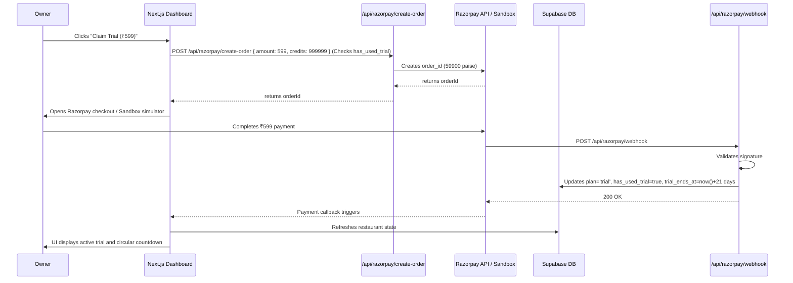

# Design Spec: 21-Day Unlimited Trial (₹599) & Onboarding Flow

Implementation plan to transition Restoloop onboarding to a low-friction Account-First flow, introducing a ₹599 21-Day Growth Trial package, dashboard feature gating, and a circular credits warning widget in the header.

## Requirements

1. **Account-First Flow**:
   * Owners register and log in instantly, entering the `/dashboard` directly without initial payment blocking.
   * Onboarding defaults: `plan = 'free'`, `credits = 0`, and `has_used_trial = false`.

2. **Trial Activation & Feature Gating**:
   * A premium, glassmorphic **Virtual Membership Card** banner displayed at the top of the dashboard containing the value prop and a "Claim Trial (₹599)" button.
   * If the trial has not been activated, core campaigns and features (such as downloading/printing the table QR code in Settings) are locked.
   * Once paid, the card updates to show an SVG circular dial tracking trial days remaining (21 days) with unlimited campaign messaging.
   * Once the trial expires, features lock again, and the user is prompted to buy standard credit top-up plans. The ₹599 trial button is hidden to prevent re-activation.

3. **Circular Credit Widget in Header**:
   * An SVG circular progress ring positioned in the top-right corner of the dashboard layout.
   * Displays the remaining credit count in the center of the ring.
   * If credits fall below **200**, the ring color transitions to **orange/red** and a tooltip/badge displays **"please top up"**.
   * Clicking the widget redirects the user directly to `/dashboard/settings`.
   * While the trial is active, the circular indicator displays the infinity symbol (`∞`) or indicates unlimited status.

4. **Razorpay Trial Integration**:
   * Integrate a ₹599 package under the existing order creation and webhook systems.
   * Protect against trial abuse by enforcing `has_used_trial` flags in database rows.

---

## Proposed System Architecture

### Sequence Diagram: Payment and Trial Activation

---

## Key Files to Create / Modify

### 1. [NEW] `supabase/migrations/007_trial_state.sql`
Adds columns `has_used_trial`, `trial_ends_at`, and `trial_activated_at` to the `restaurants` table. Sets the default value of `credits` for new registrations to `0`.

### 2. [MODIFY] `src/app/api/razorpay/create-order/route.ts`
Modify to support the `'trial'` package for ₹599. Check the `has_used_trial` flag for the restaurant and reject the order with a 400 Bad Request error if a trial has already been claimed.

### 3. [MODIFY] `src/app/api/razorpay/webhook/route.ts`
Modify to handle payment capture for `'trial'`. In the webhook logic, instead of incrementing credits, update:
* `plan = 'trial'`
* `has_used_trial = true`
* `trial_activated_at = now()`
* `trial_ends_at = now() + 21 days`

### 4. [MODIFY] `src/lib/campaigns/index.ts`
Update the campaign engine's credit check logic (e.g., in `runWelcomeReminders`, `runBirthdayCampaigns`, and credit deduction helper functions) to bypass credit deductions and allow execution if:
* `plan === 'trial'` and `trial_ends_at > now()`.

### 5. [MODIFY] `src/app/dashboard/layout.tsx`
* Fetch the restaurant's credits, plan, and trial state on the server.
* Add a global header section with the SVG circular credits indicator in the top-right corner.
* Render the warning label "please top up" next to the SVG progress ring if credits are < 200 (and they are not in an active trial).
* Clicking the circular indicator redirects to `/dashboard/settings`.

### 6. [MODIFY] `src/app/dashboard/page.tsx`
* Render the **Virtual Membership Card** banner at the top of the dashboard.
* Compute and pass trial values (`has_used_trial`, `trial_ends_at`, `plan`) to display the correct state (Exploratory / Active Trial countdown / Expired Trial warning).

### 7. [MODIFY] `src/app/dashboard/settings/page.tsx`
* Enforce table QR code locking in Exploratory and Expired states. Apply a glassmorphic blurred overlay on the QR card if the trial is inactive.

---

## Verification Plan

### Automated Tests
* Create E2E test `tests/trial-flow.spec.ts` using Playwright:
  * Register a new owner and verify they are redirected to `/dashboard` automatically.
  * Verify that the "Claim Trial (₹599)" banner is visible and table QR code download card in settings is locked.
  * Click "Claim Trial" and trigger the Sandbox payment simulator. Confirm that on success, the dashboard card updates to the active trial dial and settings unlocks the table QR code.
  * Send a webhook call to simulate trial expiration (`trial_ends_at = now() - 1 sec`) and verify the dashboard switches to the expired state and locks features.
  * Attempt to create another trial order for the same user and verify that it is rejected.
