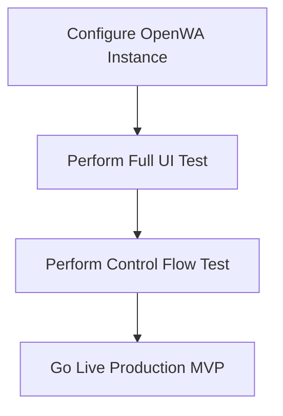

# Restoloop Production Readiness & Future Testing Plan

This document outlines the remaining prerequisites and testing steps to transition Restoloop from local simulation (using mock adapters and sandbox controls) to a live, production-ready MVP.

---

## 1. Production Prerequisites

### A. API Credentials & Environment Variables
Before going live, secure and configure the following environment secrets in your hosting provider (e.g., Vercel):

* **Supabase Production Credentials:**
  * `NEXT_PUBLIC_SUPABASE_URL`
  * `NEXT_PUBLIC_SUPABASE_ANON_KEY`
  * `SUPABASE_SERVICE_ROLE_KEY` (Used securely by the server to query and write across RLS borders on the admin portal)

* **Razorpay Payment Credentials:**
  * `RAZORPAY_KEY_ID`
  * `RAZORPAY_KEY_SECRET`
  * `RAZORPAY_WEBHOOK_SECRET` (For verifying live webhook signatures inside [razorpay.ts](file:///e:/desktop/Restoloop/src/lib/razorpay.ts))

* **WhatsApp Provider Configuration:**
  * **OpenWA Config:** `OPENWA_BASE_URL` (For pointing to your self-hosted OpenWA server).
  * **Meta Config:** Permanent WABA ID (WhatsApp Business Account ID), Phone Number ID, and system access tokens.

### B. WhatsApp Template & Business Verification
If using the Meta Cloud API provider:
* Outbound templates (Welcome, Birthday, and Winback campaign messages) must be approved by Meta.
* Business verification is required to scale past sandbox template sending limits.

### C. Headless OpenWA VPS Hosting
If using `WHATSAPP_PROVIDER=openwa` via [OpenWAAdapter](file:///e:/desktop/Restoloop/src/lib/whatsapp/openwa.ts):
* Host a permanent Node/Docker container with Chromium running the OpenWA server, connected to a dedicated WhatsApp business number.

### D. Production Domain & Live QR Generator
* A live custom domain to generate short public URL slugs like `/form/[slug]` for the intake forms.
* Ensure physical QR code PDFs are generated with the production base URL.

### E. Vercel Cron Scheduling
* Set up a production cron schedule pointing to the daily campaign endpoint at **10:00 AM IST (04:30 AM UTC)**.
* Restrict access using a private `CRON_SECRET` authorization header.

---

## 2. Execution & Testing Strategy

As per the user plan, the next steps are structured as follows:

### Step 1: OpenWA Configuration
* Provide the live OpenWA credentials and connect to the active WhatsApp instance.
* Switch the WhatsApp adapter dynamically via the `WHATSAPP_PROVIDER=openwa` environment flag handled in [createWhatsAppAdapter](file:///e:/desktop/Restoloop/src/lib/whatsapp/adapter.ts#L5).

### Step 2: Full UI Verification
* Run user interface audits to ensure elements correctly follow the Crimson & Warm Saffron color theme.
* Validate mobile layouts for restaurant dashboards, active guest tables, coupon management lists, and the public intake form page.

### Step 3: Control Flow Verification
* Test end-to-end webhook interactions (e.g., customer scanning QR code, replying with `YES` / `STOP` to opt-in/opt-out).
* Verify database-level credit deduction rules during automated campaigns.
